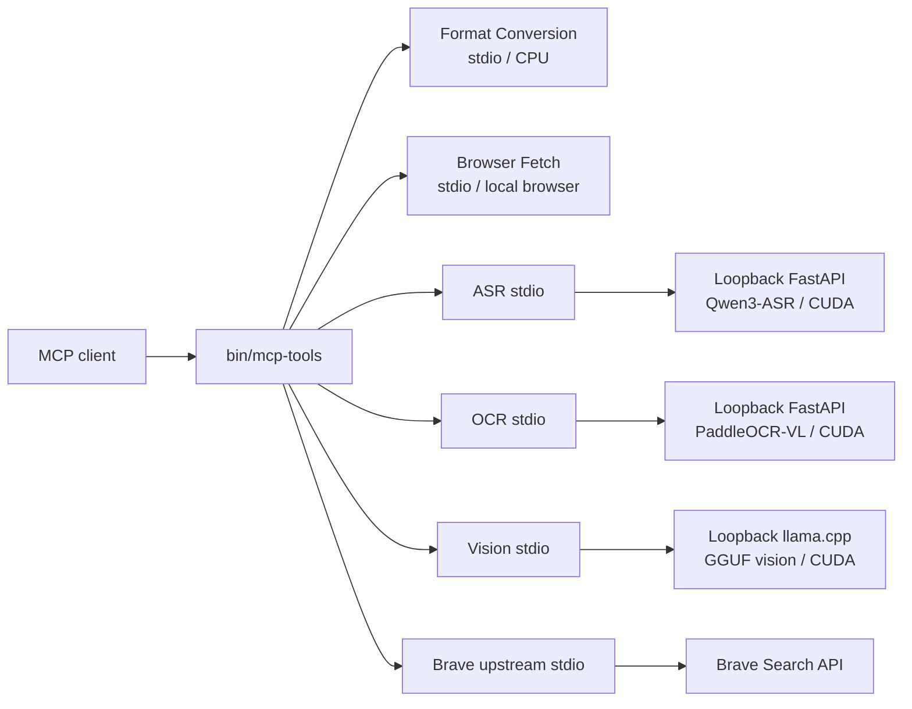

# mcp-tools

[](environments/README.md)
[](LICENSE)

A ready-to-use MCP toolkit that gives AI agents practical local capabilities:
document OCR, speech recognition, speaker diarization, image understanding,
document conversion, and browser-based web access. An optional Brave Search
launcher adds API-backed search.

Built for developers running MCP clients on Linux or WSL2, `mcp-tools` provides
six stdio server entry points, 25 repository-owned tools, reproducible uv
environments, and one repository-relative launcher. Start with a CPU-only MCP
round trip; add the CUDA or external-service profiles you actually need.

**OCR · ASR · diarization · vision · PDF/SVG conversion · browser fetch · web search**

[Quick start](#quick-start) · [Capabilities](#capabilities) ·
[Client setup](#mcp-client-setup) · [Examples](#real-world-workflows) ·
[Contributing](CONTRIBUTING.md)

## Why this project exists

Giving an agent useful local media and document abilities often means operating
several unrelated runtimes: one for OCR, another for speech, a browser process,
a document renderer, and a vision backend. This repository keeps those services
behind the same MCP stdio interface while preserving separate, locked runtime
profiles where their dependencies conflict.

The local inference services communicate with loopback backends and do not send
input documents, audio, or images to a hosted inference API. Model downloads,
Browser Fetch targets, and Brave Search still use the network. Model weights and
browser binaries are not stored in Git.

## Capabilities

| Capability | MCP tools | What it does | Execution and requirements |
|---|---|---|---|
| Document and image conversion | `inspect_pdf_links`, `pdf_to_text`, `markdown_to_pdf`, `html_to_pdf`, `svg_to_png` | Checks actual PDF targets before rendering Markdown/HTML, extracts PDF text, polishes portable reports, or rasterizes SVG | Local CPU; Chromium is the default PDF renderer; inspection, text extraction, and SVG need neither a browser nor CUDA |
| Browser fetch | `fetch_page`, `fetch_page_with_engine`, `screenshot`, `browser_status` | Renders JavaScript-heavy pages and returns Markdown, text, HTML, or PNG | Local Chrome/Chromium process plus network access to the target site |
| Document OCR | `ocr_document`, `ocr_submit`, `ocr_wait`, `ocr_status` | Converts images and scanned PDFs into ordered Markdown artifacts through a durable job queue | Local NVIDIA GPU; current backend is PP-DocLayoutV3 plus PaddleOCR-VL-1.6 |
| Speech recognition | `transcribe_audio`, `asr_status` | Transcribes common audio formats and automatically chunks long recordings | Local NVIDIA GPU; selectable Qwen3-ASR-1.7B default or bounded 0.6B profile, plus system FFmpeg |
| Speaker-aware transcription | `transcribe_diarized`, `transcribe_podcast` | Produces speaker-attributed, timestamped text or a transcript plus separate speaker timeline | Local NVIDIA GPU; `HF_TOKEN` and accepted pyannote model terms |
| Image understanding | `vision_status`, `analyze_image`, `extract_text_from_image`, `analyze_chart` | Answers visual questions, reads visible text, and analyzes charts | Local NVIDIA GPU; repository-local CUDA llama.cpp build and user-provided GGUF/projector files |
| Resumable image audit | `classify_eyewear`, `verify_eyewear`, `classify_eyewear_batch`, `eyewear_batch_status` | Runs structured single-image checks and resumable labeled-directory audits | Same local Vision runtime; outputs JSONL, JSON, CSV, and progress artifacts |
| Web search | Upstream Brave Search MCP tools | Searches web, news, images, video, places, and LLM-oriented results | External Brave Search API; Node.js, `npx`, and `BRAVE_API_KEY` |

The standalone [`asr-pipeline`](asr-pipeline/README.md) CLI exposes the same
long-audio transcription, diarization, timestamping, and merge stages used by
`transcribe_diarized`.

The optional [PDF Local Links](vscode-pdf/README.md) VS Code extension is a local
fork of `vscode-pdf`. It opens PDF and other local file references in VS Code,
including cross-repository files in the same WSL connection. It has its own
Node build and VSIX package and is not an MCP server or a Python dependency.

## Quick start

The shortest reliable path exercises a real server through MCP without CUDA, a
browser, an API key, or committed binary fixtures. It requires Linux x86-64 or
WSL2, Git, and [uv](https://docs.astral.sh/uv/).

```bash
git clone https://github.com/lanxiukai/mcp-tools.git
cd mcp-tools

# Restore the locked Python 3.12 CPU environment.
uv sync --project environments/mcp-local --locked

# Inspect installed runtimes and optional model-backed capabilities.
bin/mcp-tools doctor

# Create a temporary PDF, call pdf_to_text over MCP stdio, and verify the result.
environments/mcp-local/.venv/bin/python examples/pdf_to_text_demo.py
```

Successful output ends with:

```text
Connected tools: markdown_to_pdf, html_to_pdf, svg_to_png, pdf_to_text
Extracted text: Hello from mcp-tools over MCP stdio.
MCP round trip: OK
```

The demo removes its temporary files. See [`examples/`](examples/README.md) for
its implementation.

### Connect the first server

Every service is launched through `bin/mcp-tools`, so client configuration needs
one executable path plus a stable service argument instead of a separate Python
and script path for each component.

For Codex CLI, run this from the repository root:

```bash
codex mcp add mcp-tools-format -- "$(pwd)/bin/mcp-tools" format-conversion
codex mcp list
```

Then ask the client:

> Extract the embedded text from `/absolute/path/to/report.pdf` with
> `pdf_to_text`.

For Claude Desktop, Cursor, VS Code, OpenCode, and generic clients, see the
copy-pasteable configurations in
[`docs/client-configuration.md`](docs/client-configuration.md).

## Installation profiles

`install.sh` restores locked environments; it does not use the Linux
distribution Python. Run it from the repository root.

| Profile | Command | Includes | Additional requirements |
|---|---|---|---|
| Shared CPU | `bash install.sh --cpu-only` | Format Conversion (including SVG rasterization), Browser Fetch, and the lightweight Vision Local MCP frontend | Cairo/Pango, Node.js/npm, Playwright Chromium, browser system libraries, and fonts for the complete feature set |
| ASR | `bash install.sh --asr-only` | Qwen3-ASR and the ASR Pipeline | NVIDIA GPU, compatible CUDA driver, system FFmpeg, model download access |
| OCR | `bash install.sh --ocr-only` | PaddleOCR-VL recognition and PP-DocLayoutV3 layout | NVIDIA GPU, compatible CUDA driver, model download access |
| All Python profiles | `bash install.sh` | CPU, ASR, and OCR profiles | All requirements above; this can download several gigabytes |

Two capabilities need separate provisioning:

- **Vision Local backend:** `bash install.sh --cpu-only` installs only the MCP
  frontend. Build the pinned CUDA llama.cpp server with
  `bash vision-local/install_runtime.sh`, provide the documented model and
  projector files, and verify them with `vision_status`. See
  [`vision-local/README.md`](vision-local/README.md).
- **Brave Websearch:** no Python profile is needed. Install Node.js 22 or newer,
  set `BRAVE_API_KEY` in the MCP client's environment, and launch
  `bin/mcp-tools brave-websearch`.

The default ASR 1.7B and Vision 9B configurations are 12 GiB reference
profiles and are not advertised as 8 GB-compatible. Dedicated `8gb` profiles
use ASR 0.6B and Vision 4B with bounded runtime settings; real sequential tests
observed conservative maxima of 4658 MiB and 5518 MiB across two sequential
whole-device runs under an 8000 MiB ceiling.
The repository does not currently provide Docker images, non-NVIDIA GPU
profiles, or a macOS Python lock target.

## MCP client setup

The launcher accepts one of these stable server names:

| Server name | Runtime profile | MCP entry point |
|---|---|---|
| `format-conversion` | `mcp-local` | Markdown/HTML/PDF/SVG tools |
| `browser-fetch` | `mcp-local` | Rendered page tools |
| `asr` | `mcp-local-asr` | ASR and diarization tools |
| `ocr` | `mcp-local-ocr` | Durable OCR tools |
| `vision-local` | `mcp-local` frontend + separate backend | Vision and batch tools |
| `brave-websearch` | Node.js / upstream package | Brave Search tools |

The transport is standard MCP stdio. A generic command-based client entry is:

```json
{
  "mcpServers": {
    "mcp-tools-format": {
      "command": "/absolute/path/to/mcp-tools/bin/mcp-tools",
      "args": ["format-conversion"]
    }
  }
}
```

Use absolute paths: desktop clients commonly start servers from a different
working directory. Put secrets in the client's environment settings rather
than in tracked configuration. Detailed configurations and client-specific
file locations are in
[`docs/client-configuration.md`](docs/client-configuration.md).

## Real-world workflows

### Extract text from a scanned PDF

User request:

> Extract the text from this scanned PDF and summarize it.

Recommended routing:

1. Call `pdf_to_text` first because born-digital PDFs are faster and more
   accurate to extract directly.
2. If the result is empty or loses required layout, call `ocr_document`.
3. Read the returned Markdown artifact paths, then summarize their contents.

For a large scan, use `ocr_submit`, poll with `ocr_status`, and wait in bounded
windows with `ocr_wait`.

### Transcribe a meeting and identify speakers

User request:

> Transcribe this meeting recording, identify the speakers, and keep word
> timestamps.

Call `transcribe_diarized`. It runs preprocessing, pyannote diarization,
timestamped Qwen3-ASR transcription, and speaker/text merging. `HF_TOKEN` is
required. Use `transcribe_audio` when speaker identity is not needed.

### Convert Markdown into a readable PDF

User request:

> Convert this Markdown report into a polished PDF using the print theme.

Call `markdown_to_pdf` with `theme="print"`. Chromium is the default renderer;
`engine="weasyprint"` is available for simpler documents. The tool returns the
output path and file size.

### Rasterize an SVG safely

User request:

> Convert this SVG diagram to a 1600-pixel-wide PNG.

Call `svg_to_png` with `output_width=1600`. The CPU-only converter preserves
the aspect ratio when only one dimension is supplied, blocks external file and
network resources, bounds the requested canvas, and atomically publishes a
validated PNG.

### Read a JavaScript-rendered page

User request:

> Fetch this page after JavaScript renders and return the article as Markdown.

Call `fetch_page`. It tries nodriver first and falls back to Playwright. Use
cookies or a proxy only when you are authorized to access the target content.

## Architecture



ASR and OCR automatically manage their loopback backends. On a 12 GiB GPU they
stop competing resident services before loading another model. Vision uses an
independent pinned llama.cpp build and three runtime profiles. Keep all
heavyweight GPU workloads serialized on limited-VRAM machines. The 8 GB GPU
integration harness refuses to start when a heavyweight service port is active
and waits for memory release between ASR and Vision. Deliberate overlap tests
require an explicit budget above 8000 MiB and are not authorized by the 8 GB
profile switch.

## Configuration

All variables are optional unless the requirement column says otherwise. Set
them in the MCP client process environment.

| Variable | Required | Purpose and example |
|---|---|---|
| `HF_TOKEN` | For speaker diarization | Hugging Face token with accepted pyannote model access; use `<HUGGING_FACE_TOKEN>` |
| `BRAVE_API_KEY` | For Brave Websearch | Brave Search API credential; use `<BRAVE_SEARCH_API_KEY>` |
| `MCP_TOOLS_MODEL_DIR` | No | Shared OCR/Vision local model root; defaults to `$XDG_CACHE_HOME/mcp-tools/models` or `~/.cache/mcp-tools/models` |
| `ASR_HOST`, `ASR_PORT` | No | Loopback ASR backend address; defaults to `localhost:8000` |
| `ASR_PROFILE` | No | `default` uses Qwen3-ASR-1.7B; `8gb` selects the separately tested Qwen3-ASR-0.6B REST profile |
| `ASR_MODEL` | No | Explicit local model or Hub ID; custom weights are outside the recorded 8 GB result |
| `ASR_IDLE_TIMEOUT` | No | Seconds before the ASR backend releases the GPU; default `300` |
| `ASR_LOG_FILE` | No | MCP startup error log path; default `/tmp/qwen3-asr-server.log` |
| `OCR_HOST`, `OCR_PORT` | No | Loopback OCR backend address; defaults to `127.0.0.1:8002` |
| `OCR_MODEL_NAME`, `OCR_MODEL_ROOT` | No | Replace the OCR model ID/path or its local search root; otherwise use `MCP_TOOLS_MODEL_DIR/ocr` and the Hugging Face cache/Hub |
| `OCR_LAYOUT_MODEL` | No | Explicit PP-DocLayoutV3 directory; otherwise use configured model roots or the PaddleX managed cache |
| `OCR_JOB_ROOT` | No | Durable queue and artifact directory; defaults below `$XDG_STATE_HOME/ocr/jobs` |
| `OCR_JOB_TTL_SECONDS` | No | Completed artifact retention; default `3600` |
| `OCR_USE_LAYOUT` | No | Set `0` to disable the isolated layout stage; default `1` |
| `VISION_LOCAL_SERVER_BINARY` | If the default build is absent | llama.cpp server path; for example `/opt/llama.cpp/bin/llama-server` |
| `VISION_LOCAL_MODEL_PATH` | If the default model is absent | Interactive GGUF model path; for example `/models/vision/model.gguf` |
| `VISION_LOCAL_MMPROJ_PATH` | If the default projector is absent | Interactive vision projector path; for example `/models/vision/mmproj.gguf` |
| `VISION_LOCAL_MODEL_DIR` | No | Root containing the Vision model directories used by all profiles; defaults to `MCP_TOOLS_MODEL_DIR/vision` |
| `VISION_LOCAL_PROFILE` | No | `default` uses the 9B interactive profile; `8gb` selects the bounded 4B interactive profile |
| `VISION_LOCAL_PORT` | No | Interactive loopback port; default `8003` |
| `VISION_LOCAL_8GB_*` | For non-default bounded paths/settings | 8 GB model, projector, port, context, GPU-layer, batch, timeout, and log variables; bounded port defaults to `8005` |
| `VISION_LOCAL_BATCH_*` | For non-default batch paths/settings | Batch equivalents of model, projector, port, context, timeout, and log variables; batch port defaults to `8004` |
| `BROWSER_FETCH_TIMEOUT` | No | Default page timeout in seconds; default `30` |
| `BROWSER_FETCH_HEADLESS` | No | Browser mode; default `true` |
| `BROWSER_FETCH_USER_AGENT` | No | Override the browser user agent |
| `BROWSER_FETCH_SCREENSHOT_DIR` | No | Default PNG output directory; default `/tmp/browser-fetch` |
| `BROWSER_FETCH_LOG_LEVEL` | No | `INFO` or `DEBUG`; default `INFO` |
| `MATHJAX_NODE_PATH` | No | Override the pinned local MathJax Node entry point |

Backend tuning variables are documented in
[`ocr/README.md`](ocr/README.md#configuration),
[`vision-local/README.md`](vision-local/README.md#configuration),
[`browser-fetch/README.md`](browser-fetch/README.md#environment-variables), and
the launcher header in [`brave-websearch/run.sh`](brave-websearch/run.sh).

## Troubleshooting

| Symptom | Check |
|---|---|
| Launcher reports a missing interpreter | Restore the named profile with `uv sync --project environments/<profile> --locked` or run the matching `install.sh` option |
| Client shows no tools | Use an absolute launcher path, run `bin/mcp-tools doctor`, inspect the client's MCP stderr log, then restart or reload the client |
| CPU demo hangs only inside a restricted sandbox | Allow local process/stdio IPC or run the demo in the host terminal; the server itself does not need network access for this demo |
| CUDA is unavailable | Run `nvidia-smi`, then check the selected profile with its locked interpreter; WSL2 also requires a working Windows NVIDIA driver |
| A model cannot be loaded | Check the documented model path, free disk space, download access, and whether a partial snapshot is being mistaken for a complete one |
| Diarization reports authentication failure | Accept the pyannote model terms and pass `HF_TOKEN` to the ASR MCP process |
| Browser launch fails | Run the CPU installer or `playwright install chromium`; install the browser system libraries described in [`browser-fetch/README.md`](browser-fetch/README.md) |
| `pdf_to_text` returns empty text | The PDF is probably scanned or image-only; use `ocr_document` |
| Vision reports missing artifacts | Run `vision_status`, build `vision-local/install_runtime.sh`, and configure both the GGUF model and projector paths |
| OCR or ASR stops when the other starts | This is intentional shared-GPU exclusion for the reference 12 GiB setup; check the component status tool before retrying |

## Documentation

| Document | Use it for |
|---|---|
| [`docs/client-configuration.md`](docs/client-configuration.md) | Claude Desktop, Cursor, VS Code, Codex, OpenCode, and generic stdio configuration |
| [`docs/tools-reference.md`](docs/tools-reference.md) | Tool parameters, return shapes, and deeper runtime notes |
| [`docs/mcp-tools-testing.md`](docs/mcp-tools-testing.md) | Manual calls, smoke tests, and test fixtures |
| [`docs/reliability-test-matrix.md`](docs/reliability-test-matrix.md) | Risk tiers, per-tool hardening coverage, stress results, defects, and tested platform scope |
| [`environments/README.md`](environments/README.md) | Locked uv profiles and profile-specific test commands |
| [`asr/README.md`](asr/README.md) | ASR formats, model resolution, REST backend, and troubleshooting |
| [`ocr/README.md`](ocr/README.md) | OCR queue, artifacts, backend configuration, and model switching |
| [`vision-local/README.md`](vision-local/README.md) | CUDA llama.cpp build, model profiles, and batch audit artifacts |
| [`format-conversion/README.md`](format-conversion/README.md) | PDF engines, clickable web and cross-repository file links, SVG rasterization, safety limits, themes, fonts, and CLI usage |
| [`browser-fetch/README.md`](browser-fetch/README.md) | Browser engines, cookies, proxies, and site-specific limitations |
| [`SECURITY.md`](SECURITY.md) | Private vulnerability reporting and supported versions |
| [`CHANGELOG.md`](CHANGELOG.md) | Version history |

Historical hardware measurements and fixture-specific verification reports live
under [`docs/`](docs/). Treat them as dated evidence for their stated hardware,
not universal benchmarks.

## Contributing

See [`CONTRIBUTING.md`](CONTRIBUTING.md) for profile setup, tests, linting,
adding an MCP tool, and the pull-request checklist. Bug reports and feature
requests have guided forms under `.github/ISSUE_TEMPLATE/`.

Run the normal CPU-safe contributor gate with `scripts/check.sh`. It covers
Ruff, shell syntax, CPU tests, all five repository-owned MCP frontends, the
PDF-to-text example, documentation links, GitHub YAML, diagnostics, and
whitespace checks. GitHub Actions runs this gate on both `ubuntu-22.04` and
`ubuntu-24.04`; GPU integration remains opt-in and local.

Good contribution entry points include:

- add a protocol-level test for one existing stdio server (`good first issue`);
- improve a component's actionable error messages (`good first issue`);
- add a repo-owned Vision model download helper (`help wanted`);
- validate and document another Linux NVIDIA GPU/driver combination (`help wanted`);
- design a CPU or non-NVIDIA backend without changing the stable MCP tool names
  (`help wanted`).

## Roadmap

These are planned ideas, not current features:

- add an optional, license-aware Vision model download helper;
- add tested CPU or non-NVIDIA alternatives for selected inference services;
- publish profile-specific containers only after GPU and artifact persistence
  behavior can be tested reproducibly;
- add portable client-config generation and validation.

## License

Repository source and documentation are licensed under the
[MIT License](LICENSE). Runtime dependencies and downloaded models retain their
own licenses and usage terms; review them before redistribution.
